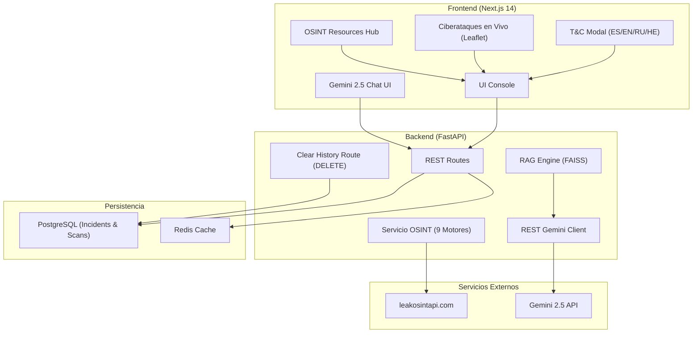

<p align="center">
  
  
  
  
  
</p>

<h1 align="center">🛡️ LeakGuard</h1>

<p align="center">
  Plataforma unificada de <strong>Threat Intelligence</strong> y verificación de filtraciones OSINT de grado corporativo. Diseñada con proxy seguro, análisis de riesgo heurístico, encriptación local y un asistente inteligente basado en <strong>Gemini 2.5 Flash</strong>.
</p>

<p align="center">
  
  
  
  
  
  
</p>

---

## 🗂️ Tabla de Contenidos

- [Descripción](#descripción)
- [Novedades](#novedades)
- [Stack Tecnológico](#stack-tecnológico)
- [Arquitectura](#arquitectura)
- [Motores OSINT Soportados](#motores-osint-soportados)
- [Referencia de API](#referencia-de-api)
- [Inicio Rápido](#inicio-rápido)
- [Configuración de Entorno](#configuración-de-entorno)
- [Verificación y Testing](#verificación-y-testing)
- [Seguridad & Privacidad](#seguridad--privacidad)
- [Términos y Condiciones](#términos-y-condiciones)
- [Contribuidores](#contribuidores)

---

## 📖 Descripción

**LeakGuard** proporciona a analistas y equipos de ciberseguridad una consola centralizada para monitorear y mitigar filtraciones de credenciales.

### Características principales:
- **Proxy Seguro:** El navegador del cliente nunca interactúa directamente con proveedores OSINT de pago, previniendo fugas de claves de API.
- **Iconografía Profesional:** Interfaz corporativa basada exclusivamente en componentes **Lucide-react** con badges de países (`[AR]`, `[CL]`, `[BO]`, etc.).
- **Asistente IA (Gemini 2.5 Flash):** Chat interactivo para profundizar en mitigaciones e impacto técnico directamente con la IA de Google.
- **K-Anonymity:** Buscador seguro mediante hash SHA-256 truncado para proteger la privacidad del usuario al escanear.
- **Términos y Condiciones Multiidioma:** Cobertura legal en Español, Inglés, Ruso y Hebreo con marco jurisdiccional de EE. UU.

---

## 🔥 Novedades

### Versión actual — v3.7.0

1. **Automatización de Motores OSINT & Dossier de Actores**: Integración automática de 9 motores de búsqueda de filtraciones de datos (CredenShow, HIB Ransomed, HEROIC.NOW, etc.) en las verificaciones de exposición y buscador específico de dossiers de inteligencia para Actores de Amenaza (Lazarus, LockBit, Volt Typhoon, etc.) con mapas de TTPs y mitigaciones de MITRE.
2. **Ciberataques en Vivo con Datos Reales**: Mapa interactivo de ataques en tiempo real en el Dashboard alimentado dinámicamente con incidentes de la base de datos y el feed de brechas LATAM_BREACHES. Muestra vectores de ataque interactivos animados y un ticker log en vivo con nombres de organizaciones reales, sectores y geolocalizaciones.
3. **Limpieza de Historial de Consultas**: Botón de limpieza en la tarjeta de historial del Dashboard y endpoint de backend `DELETE` para vaciar el historial de búsquedas realizadas, con soporte multilingüe completo.
4. **Tipado Estricto de Datos & Corrección de Bugs**: Corrección de tipos TypeScript para respuestas de incidentes (`IncidentRecord`), tipado estricto de coordenadas en Leaflet (`[number, number]`), y solución de lints/warnings del compilador Next.js.

### Versión anterior — v3.6.0

1. **Hub de Recursos OSINT Integrado:** Nueva página `/resources` (Fuentes OSINT) con más de 40 enlaces categorizados a buscadores de filtraciones de datos (CredenShow, HIB Ransomed, iknowyour.dad, etc.), bases de datos de actores de amenazas (Malpedia, SOCRadar, ETDA, etc.) y mapas de ciberamenazas en tiempo real.
2. **Buscador y Filtro por Categorías:** Filtrado reactivo en tiempo real con barra de búsqueda integrada y tags para identificar rápidamente las herramientas.
3. **Internacionalización Completa:** Soporte multiidioma (Español, Inglés, Ruso, Hebreo) para la sección de recursos.
4. **Corrección de Lints y Dependencias:** Limpieza de imports no usados y catch bindings redundantes en Next.js y FastAPI.

### Versión anterior — v3.5.0

1. **Términos & Condiciones Legales Multiidioma:** Página completa de T&C con 5 secciones legales (Propósito, Neutralidad, Censura, Privacidad, Jurisdicción) disponibles en **ES · EN · RU · HE**.
2. **Modal de Aceptación en Login:** Checkbox obligatorio en el formulario de inicio de sesión que despliega los T&C en modal.
3. **Sección de Contribuidores en Landing:** Footer actualizado con los perfiles GitHub de todos los colaboradores del proyecto.
4. **Canvas de Iconos Profesionales:** El fondo animado del landing page ahora usa iconos vectoriales dibujados a mano (Shield, Lock, Key, Radar, Hexagon) en lugar de texto ASCII.
5. **Corrección de Caché Next.js:** Resolución del error `MODULE_NOT_FOUND` por chunks corruptos en `.next`.

1. **Google Gemini 2.5 Flash Nativo:** Eliminación de los wrappers de OpenAI SDK para conectar directamente mediante REST (`httpx`) con el endpoint oficial de Google Generative Language.
2. **Chat Assistant en AI Safety:** Panel conversacional interactivo con RAG (FAISS) + Gemini en tiempo real.
3. **Expansión LATAM:** Seeding extendido con filtraciones para **Bolivia**, **Brasil**, **Perú**, **Colombia** y **México**.
4. **Emoji-Free UI:** Reemplazo integral de emojis por badges de diseño premium.
5. **Cero Fugas de Auth:** Control de peticiones asíncronas para evitar llamadas 401 antes de resolver el estado de autenticación.
6. **Bypass de Bcrypt local:** Solución para incompatibilidades en registro local mediante `bcrypt` puro.

---

## 💻 Stack Tecnológico

| Capa | Tecnología |
|------|------------|
| **Frontend** | Next.js 14 (App Router), TypeScript, Tailwind CSS, shadcn/ui |
| **Backend** | Python 3.11 + FastAPI (async nativo), pytest |
| **Base de Datos** | PostgreSQL (Auditoría, Incidentes, Logs, Usuarios) |
| **Cache & Colas** | Redis (Cache de feed ransomware y estado de APIs) |
| **Inteligencia Artificial** | Gemini 2.5 Flash + FAISS (RAG Local y Offline en fallback) |
| **Monitoreo & OSINT** | Playwright + BeautifulSoup + leakosintapi.com |
| **Hub de OSINT** | Buscadores, Actores de Amenaza y Mapas de Ciberamenazas en Vivo (40+ recursos) |
| **Ciberataques en Vivo** | Mapa interactivo animado de ciberataques alimentado con geolocalización e incidentes reales |
| **i18n Completo** | Español · English · Русский · עברית |

---

## 🏗️ Arquitectura



---

## 🔍 Motores OSINT Soportados

LeakGuard consolida y automatiza la búsqueda de identidades expuestas a través de 9 bases de datos y motores OSINT de referencia:

| Motor OSINT | Tipo de Datos / Cobertura | Enlace de Referencia |
|-------------|----------------------------|----------------------|
| **CredenShow** | Identificación de credenciales corporativas comprometidas | [credenshow.com](https://credenshow.com) |
| **HIB Ransomed** | Monitoreo de bases de datos secuestradas por ransomware | [haveibeenransom.com](https://haveibeenransom.com) |
| **HEROIC.NOW** | Escáner gratuito de identidades filtradas en la Dark Web | [heroic.now](https://heroic.now) |
| **IKnowYour.Dad** | Indexador recursivo de filtraciones públicas | [iknowyour.dad](https://iknowyour.dad) |
| **Leaker CLI** | Enumerador pasivo multi-base de datos simultáneo | [leaker-dev/leaker](https://github.com/leaker-dev/leaker) |
| **NOX** | Framework asíncrono para análisis de brechas e identidades | [nox-project/nox](https://github.com/nox-project/nox) |
| **OsintCat** | Búsqueda rápida de exposición de correos electrónicos | [osintcat.com](https://osintcat.com) |
| **StealSeek** | Buscador especializado en filtraciones e infostealers | [stealseek.io](https://stealseek.io) |
| **Venacus** | Alertas y monitoreo proactivo de datos expuestos | [venacus.com](https://venacus.com) |

---

## 🔌 Referencia de API (Servicios Principales)

LeakGuard expone una serie de endpoints estructurados para interactuar con la persistencia local, auditorías de incidentes y los análisis heurísticos automatizados:

### 1. Escanear Exposición / Actores de Amenazas
* **Método & Ruta**: `POST /api/v1/exposure/scan`
* **Parámetros (JSON)**:
  * `request` (string): Consulta a verificar (ej. email, dominio o actor).
  * `mode` (string): `"email"`, `"domain"` o `"phone"`.
  * `search_target` (string, opcional): `"breaches"` (por defecto) o `"actors"`.
* **Ejemplo de Solicitud**:
  ```json
  {
    "request": "Lazarus Group",
    "mode": "domain",
    "search_target": "actors"
  }
  ```
* **Ejemplo de Respuesta (Dossier de Actor)**:
  ```json
  {
    "query": "Lazarus Group",
    "searchType": "Búsqueda de Actor de Amenaza",
    "records": [
      {
        "id": "latam-ar-1",
        "date": "2025-11-14",
        "actor": "Lazarus Group",
        "victim": "Banco de la Nación Argentina",
        "sector": "Finanzas",
        "country": "Argentina",
        "riskScore": 95,
        "severity": "Critical"
      }
    ],
    "actorProfile": {
      "name": "Lazarus Group",
      "origin": "Corea del Norte (North Korea)",
      "sponsored": "State-sponsored (APT)",
      "description": "Grupo de ciberespionaje altamente sofisticado...",
      "targetSectors": ["Finanzas", "Gobierno", "Salud"],
      "typicalTools": ["swift_gate.exe", "Destructive Malware"],
      "riskScore": 93,
      "confidence": 95,
      "externals": {
        "Malpedia": "Tracked",
        "SOCRadar": "Critical"
      }
    }
  }
  ```

### 2. Consultar Historial de Escaneos
* **Método & Ruta**: `GET /api/v1/exposure/consulted`
* **Parámetros**: `limit` (int, opcional, por defecto 25).
* **Ejemplo de Respuesta**:
  ```json
  [
    {
      "query": "Lazarus Group",
      "searchType": "Búsqueda de Actor de Amenaza",
      "riskScore": 93.0,
      "totalLogins": 1,
      "timestamp": "2026-06-22T18:32:00.123456"
    }
  ]
  ```

### 3. Limpiar Historial de Escaneos
* **Método & Ruta**: `DELETE /api/v1/exposure/consulted`
* **Ejemplo de Respuesta**:
  ```json
  {
    "status": "success",
    "message": "Consultas limpiadas correctamente"
  }
  ```

---

## 🚀 Inicio Rápido

> [!TIP]
> Si no cuentas con Redis instalado localmente para la opción de desarrollo manual, puedes establecer `REDIS_URL=mock` en tu archivo `.env` del backend. El sistema activará de forma inteligente un cliente Redis simulado en memoria para facilitar las pruebas sin dependencias adicionales.

### Opción A — Ejecución con Docker (Recomendado)

1. Crea las variables de entorno copiando el archivo `.env.example`:
   ```bash
   cp .env.example .env
   ```
2. Configura tu token OSINT y tu clave API de Gemini:
   ```env
   OSINT_TOKEN=tu_token_leakosint
   OPENAI_API_KEY=tu_clave_api_gemini
   ```
3. Construye y levanta los servicios:
   ```bash
   docker compose up --build
   ```
4. Accede a la interfaz web en: **`http://localhost:3000`**

### Opción B — Desarrollo Local Manual

**1. Levantar PostgreSQL y Redis:**
```bash
docker compose up postgres redis -d
```

**2. Iniciar el Backend:**
```bash
cd backend
python -m venv .venv
source .venv/bin/activate   # Windows: .\.venv\Scripts\activate
pip install -r requirements.txt
cp .env.example .env
# Edita tu archivo .env con las API Keys correspondientes
uvicorn app.main:app --reload --port 8000
```

**3. Iniciar el Frontend:**
```bash
cd frontend
npm install
npm run dev
```

---

## ⚙️ Configuración de Entorno

> [!IMPORTANT]
> La cadena de conexión `DATABASE_URL` debe usar obligatoriamente el driver asíncrono `postgresql+asyncpg://` en lugar del driver tradicional, para poder soportar el modelo de concurrencia asíncrona de FastAPI y SQLAlchemy.
>
> [!WARNING]
> El token `OPENAI_API_KEY` representa tu clave de API de Google Gemini (Google AI Studio) y admite formatos tradicionales así como claves restringidas con prefijos `AIzaSy`. Asegúrate de no exponerla públicamente en repositorios de código.

### Backend `.env`
- `OSINT_TOKEN`: Token de acceso para `leakosintapi.com`.
- `OPENAI_API_KEY`: Clave de API de Gemini 2.5 Flash (soporta prefijos `AQ.` e `AIzaSy`).
- `DATABASE_URL`: URI de conexión asíncrona de PostgreSQL (`postgresql+asyncpg://`).
- `REDIS_URL`: URI de conexión a Redis (o `mock` para desarrollo sin Redis).

---

## 🧪 Verificación y Testing

LeakGuard cuenta con una suite completa de pruebas automatizadas y compilaciones de optimización para garantizar la integridad del código en producción.

### Ejecutar Pruebas del Backend (FastAPI)
Para ejecutar las pruebas unitarias y de integración del backend con `pytest`:
```bash
cd backend
.\.venv\Scripts\pytest
```

### Compilar y Validar Tipos del Frontend (Next.js)
Para verificar lints, tipos TypeScript y generar un build optimizado de producción:
```bash
cd frontend
npm run build
```

### Script de Limpieza Rápida del Historial
Para limpiar manualmente los historiales de búsqueda de la base de datos local desde la consola:
```powershell
cd backend
$env:PYTHONPATH="."
.\.venv\Scripts\python -c "import asyncio; from app.core.database import async_session; from sqlalchemy import delete; from app.models.consulted_scan import ConsultedScan; async def clear(): async with async_session() as s: await s.execute(delete(ConsultedScan)); await s.commit(); print('Historial de base de datos borrado.'); asyncio.run(clear())"
```

---

## 🔒 Seguridad & Privacidad

1. **Anonimato en Búsquedas:** Las consultas se registran únicamente como hash SHA-256 (`query_hash`). No almacenamos búsquedas en texto plano ni direcciones IP.
2. **Censura en Servidor:** Contraseñas y credenciales sensibles se ofuscan en el backend (`*****`) antes de ser enviadas al cliente.
3. **Control de JWT:** Sesión protegida mediante firmas HS256 locales.
4. **Sin Venta de Datos:** Los datos de registro (nombre y correo) se usan exclusivamente para notificar al usuario sobre filtraciones detectadas. No se comercializan ni comparten con terceros.

---

## ⚖️ Términos y Condiciones

LeakGuard opera bajo los principios legales de **plataforma intermediaria** conforme al marco de la **Section 230 del Communications Decency Act (EE. UU.)** y prácticas similares a las de plataformas de inteligencia OSINT como IntelX.

### Puntos clave:
- 🔍 **Solo información pública:** LeakGuard indexa y presenta datos que ya son públicamente accesibles en internet. No participamos ni facilitamos hackeos o filtraciones.
- 🚫 **Sin responsabilidad por filtraciones:** La plataforma no es responsable del origen de los datos filtrados. La responsabilidad de su uso recae exclusivamente en el usuario.
- 🔐 **Contraseñas censuradas:** Todas las contraseñas en texto plano son automáticamente ofuscadas antes de ser mostradas.
- 🌐 **Jurisdicción:** Cualquier disputa legal se rige bajo la ley del Estado de **Delaware, EE. UU.**
- 📄 **Idiomas disponibles:** Español · English · Русский · עברית

> Ver página completa en: `/terms`

---

## 👥 Contribuidores

<table align="center">
  <tr>
    <td align="center">
      <a href="https://github.com/paltaunkwnow">
        <br/>
        <sub><b>@paltaunkwnow</b></sub>
      </a>
    </td>
    <td align="center">
      <a href="https://github.com/emilio-garcia-ie">
        <br/>
        <sub><b>@emilio-garcia-ie</b></sub>
      </a>
    </td>
    <td align="center">
      <a href="https://github.com/invertilo">
        <br/>
        <sub><b>@invertilo</b></sub>
      </a>
    </td>
    <td align="center">
      <a href="https://github.com/fernandocastedo">
        <br/>
        <sub><b>@fernandocastedo</b></sub>
      </a>
    </td>
  </tr>
</table>


---

<p align="center">
  Diseñado con pasión para mitigar riesgos en Latinoamérica. <strong>LeakGuard © 2026</strong>.
</p>
