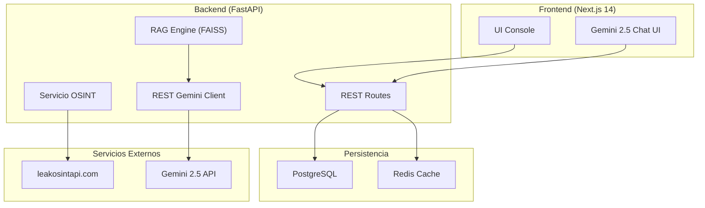

<p align="center">
  
  
</p>

<h1 align="center">🛡️ LeakGuard</h1>

<p align="center">
  Plataforma unificada de <strong>Threat Intelligence</strong> y verificación de filtraciones OSINT de grado corporativo. Diseñada con proxy seguro, análisis de riesgo heurístico, encriptación local y un asistente inteligente basado en <strong>Gemini 2.5 Flash</strong>.
</p>

<p align="center">
  
  
  
  
  
  
</p>

---

## 🗂️ Tabla de Contenidos

- [Descripción](#descripción)
- [Novedades en v3.4.0](#novedades-en-v340)
- [Stack Tecnológico](#stack-tecnológico)
- [Arquitectura](#arquitectura)
- [Inicio Rápido](#inicio-rápido)
- [Configuración de Entorno](#configuración-de-entorno)
- [Módulos de la Plataforma](#módulos-de-la-plataforma)
- [API Endpoints](#api-endpoints)
- [Testing & Integración Continua](#testing--integración-continua)
- [Seguridad & Privacidad](#seguridad--privacidad)

---

## 📖 Descripción

**LeakGuard** proporciona a analistas y equipos de ciberseguridad una consola centralizada para monitorear y mitigar filtraciones de credenciales. 

### Características principales:
- **Proxy Seguro:** El navegador del cliente nunca interactúa directamente con proveedores OSINT de pago, previniendo fugas de claves de API.
- **Iconografía Profesional y Limpia:** Interfaz corporativa libre de emojis basada exclusivamente en componentes **Lucide-react** con badges de países (`[AR]`, `[CL]`, `[BO]`, etc.).
- **Asistente IA (Gemini 2.5 Flash):** Chat interactivo para profundizar en mitigaciones e impacto técnico directamente con la IA de Google mediante su API REST nativa.
- **K-Anonymity:** Buscador seguro mediante hash SHA-256 truncado para proteger la privacidad del usuario al escanear.

---

## 🔥 Novedades en v3.4.0

1. **Google Gemini 2.5 Flash Nativo:** Eliminación de los wrappers de OpenAI SDK para conectar directamente mediante REST (`httpx`) con el endpoint oficial de Google Generative Language.
2. **Chat Assistant en AI Safety:** Panel conversacional interactivo para consultar detalles técnicos del incidente RAG (FAISS) con Gemini en tiempo real.
3. **Expansión LATAM:** Seeding inicial extendido con filtraciones principales para **Bolivia (YPFB)**, **Brasil (Petrobras)**, **Perú (MEF)**, **Colombia (Claro)** y **México (Banxico)**.
4. **Emoji-Free UI:** Reemplazo integral de emojis en tablas, popups de mapas y selectores por badges de diseño premium.
5. **Cero Fugas de Auth:** Control de peticiones asíncronas para evitar llamadas 401 a la API antes de resolver el estado de autenticación (`useAuth()`).
6. **Bypass de Bcrypt local:** Solución definitiva para incompatibilidades en registro local mediante `bcrypt` puro en backend en reemplazo de `passlib` obsoleto.

---

## 💻 Stack Tecnológico

| Capa | Tecnología |
|------|------------|
| **Frontend** | Next.js 14 (App Router), TypeScript, Tailwind CSS, shadcn/ui, Vitest |
| **Backend** | Python 3.11 + FastAPI (async nativo), pytest |
| **Base de Datos** | PostgreSQL (Auditoría, Incidentes, Logs de consultas y Usuarios) |
| **Cache & Colas** | Redis (Cache de feed ransomware y estado de APIs) |
| **Inteligencia Artificial** | Gemini 2.5 Flash + FAISS (RAG Local y Offline en fallback) |
| **Monitoreo & OSINT** | Playwright + BeautifulSoup + leakosintapi.com |

---

## 🏗️ Arquitectura



---

## 🚀 Inicio Rápido

### Opción A — Ejecución con Docker (Recomendado)

1. Crea las variables de entorno en la raíz copiando el archivo `.env.example`:
   ```bash
   cp .env.example .env
   ```
2. Configura tu token OSINT y tu clave API de Gemini:
   ```env
   OSINT_TOKEN=tu_token_leakosint
   OPENAI_API_KEY=tu_clave_api_gemini
   ```
3. Construye y levanta los servicios:
   ```bash
   docker compose up --build
   ```
4. Accede a la interfaz web en: **`http://localhost:3000`**

### Opción B — Desarrollo Local Manual

**1. Levantar PostgreSQL y Redis:**
```bash
docker compose up postgres redis -d
```

**2. Iniciar el Backend:**
```bash
cd backend
python -m venv .venv
source .venv/bin/activate # Windows: .\.venv\Scripts\activate
pip install -r requirements.txt
cp .env.example .env
# Edita tu archivo .env con las API Keys correspondientes
uvicorn app.main:app --reload --port 8000
```

**3. Iniciar el Frontend:**
```bash
cd frontend
npm install
npm run dev
```

---

## ⚙️ Configuración de Entorno

### Backend `.env`
- `OSINT_TOKEN`: Token de acceso para `leakosintapi.com`.
- `OPENAI_API_KEY`: Clave de API de Gemini 2.5 Flash (soporta prefijos `AQ.` e `AIzaSy`).
- `DATABASE_URL`: URI de conexión asíncrona de PostgreSQL (`postgresql+asyncpg://`).
- `REDIS_URL`: URI de conexión a Redis (o `mock` para desarrollo sin Redis).

---

## 🔒 Seguridad & Privacidad

1. **Anonimato en Búsquedas:** Las consultas de escaneo almacenadas en PostgreSQL se registran únicamente como hash SHA-256 (`query_hash`).
2. **Censura en Servidor:** Las contraseñas y credenciales sensibles devueltas se ofuscan en el backend (`*****`) antes de ser enviadas al navegador del cliente.
3. **Control de JWT:** Sesión protegida y autenticación robusta mediante firmas HS256 locales.

---
<p align="center">
  Diseñado con pasión para mitigar riesgos en Latinoamérica. <strong>LeakGuard © 2026</strong>.
</p>
